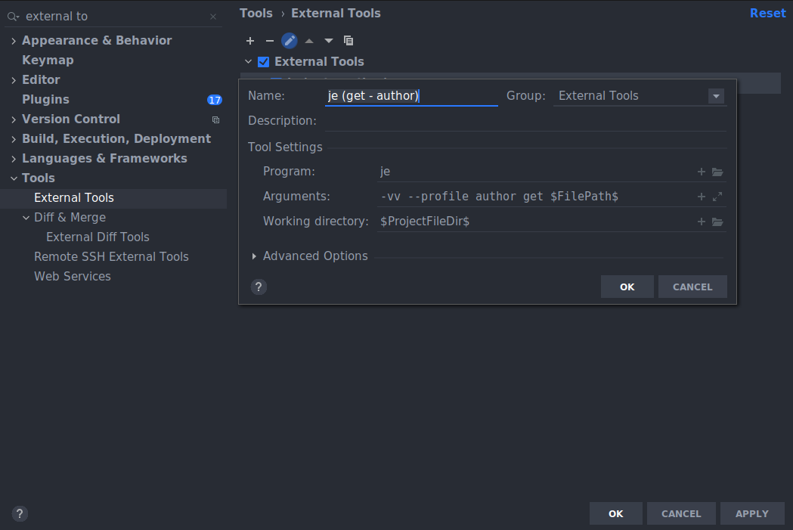
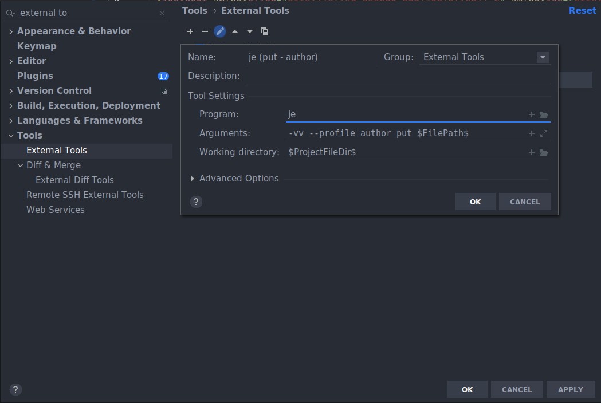
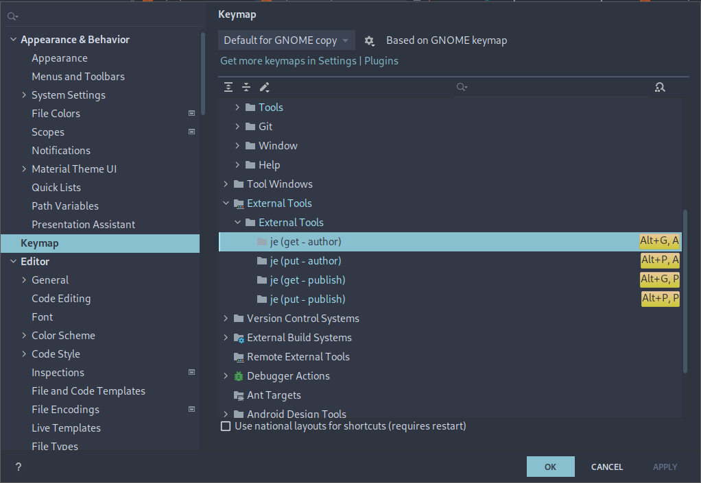

<div align="center">

  <h1><code>je</code></h1>

  <h3>
    <strong>Jcr Exchange - uploading/downloading content to/from running AEM instance</strong>
  </h3>

  <p>
    
    <a href="https://crates.io/crates/je">
      
    </a>
    <a href="https://codecov.io/gh/devzbysiu/je">
      
    </a>
    <a href="https://crates.io/crates/je">
      
    </a>
  </p>

  <h3>
    <a href="#about">About</a>
    <span> | </span>
    <a href="#installation">Installation</a>
    <span> | </span>
    <a href="#configuration">Configuration</a>
    <span> | </span>
    <a href="#license">License</a>
    <span> | </span>
    <a href="#contribution">Contribution</a>
  </h3>

  <sub><h4>Built with 🦀</h4></sub>
</div>

# <p id="about">About</p>

Small utility for uploading/downloading content to/from running AEM instance.

**It's intended to be used as an external tool for IntelliJ IDEA to make content synchronization easier.**

```bash
je 0.3.0
Jcr Exchange - easy download and upload files to and from JCR

USAGE:
    je [FLAGS] [OPTIONS] <SUBCOMMAND>

FLAGS:
    -d, --debug      If enabled, deployed to AEM packages are left intact (are not deleted) to allow investigation
    -h, --help       Prints help information
    -V, --version    Prints version information
    -v, --verbose    Enables logs: -v - enables INFO log level -vv - enables DEBUG log level

OPTIONS:
    -p, --profile <profile>    Profile selection

SUBCOMMANDS:
    get           Downloads content to local file system
    get-bundle    Downloads bundle (pack of crx paths) defined in config file
    help          Prints this message or the help of the given subcommand(s)
    init          Initializes configuration file
    put           Uploads content to AEM instance
    reinit        Rewrites the configuration file with newest version
```

# <p id="installation">Installation</p>

### Standard installation
- go to [releases](https://github.com/devzbysiu/je/releases) page
- download the latest `je` archive for your OS
- extract it
- include path to `je` executable into your PATH variable

### Rust programmers

#### Install
```bash
cargo install je
```

#### Upgrade
```bash
cargo install --force je
```

# <p id="configuration">Configuration</p>

### Default
Configuration file is **not** required. Without it, `je` will use default configuration.
However, you can still initialize config and change it. The default configuration is also the initial
one:

```
❯ je init
❯ cat .je
ignore_properties = []

[[profile]]
name = "author"
addr = "http://localhost:4502"
user = "admin"
pass = "admin"
```
### Customize
Here is more complex configuration with description of its fields:
```toml
ignore_properties = [{ type = "contains", value = "jcr:createdBy" },
                     { type = "regex", value = '.*=\[]' }]

[[profile]]
name = "author"
addr = "http://localhost:4502"
user = "admin"
pass = "admin"

[[profile]]
name = "publish"
addr = "http://localhost:4503"
user = "admin"
pass = "admin"

[[bundle]]
name = "configs"
files = ["/apps/my-app/config", "/config/my-app"]

[[bundle]]
name = "dam"
paths = ["/content/dam/my-app/thumbnails", "/content/dam/my-app/files"]
```

- `ignore_properties` - tell `je` which properties of `.content.xml` should be removed after
downloading the content; currently, two types of ignoring mechanisms are available:
  - `contains` - executes `line.contains(value)` on each line
  - `regex` - executes `regex.is_match(line)` on each line, it uses Perl-style regular expressions
- profile section - you can add multiple profiles, each with settings:
  - `name` - name of the profile, later it can be used with `--profile` option to specify which
    instance is the target; if not specified, the first profile from the config is used
  - `addr` - address of the instance, including port if domain is not available
  - `user` - user used to authenticate to AEM instance
  - `pass` - password used to authenticate to AEM instance
- bundles section - you can define packs of files which will be synchronized in one run:
  - `name` - name of the bundle, it can be later used with `--bundle` option to specify which
    file pack to synchronize
  - `paths` - which file paths are part of the bundle

> :warning: If you used older version of `je`, then you can transform the configuration file to the
new form. Details below.
<details>
  <summary>Details</summary>
  `je reinit` will change:
  
  ```toml
  ignore_properties = ["jcr:created", "jcr:createdBy"]

  # (...)
  ```
  to
  ```toml
  version = "0.3.0"

  [[ignore_properties]]
  type = "contains"
  value = "jcr:created"

  [[ignore_properties]]
  type = "contains"
  value = "jcr:createdBy"

  # (...)
  ```
  which is equivalent to:
  ```toml
  version = "0.3.0"

  ignore_properties = [{type = "contains", value = "jcr:created"},
                       {type = "contains", value = "jcr:createdBy"}]

  # (...)
  ```

  You can use any of those two formats. The difference is the result of <a href=https://github.com/alexcrichton/toml-rs/issues/265>this issue</a>.

</details>

### IntelliJ Setup

#### Add `je` commands:

1. Go to `Settings -> Tools -> External Tools`.
2. Add new external tool using `+` sign.
3. Configure the tool like on the screenshot below.



Similarly add and configure `je put` command:




##### Notes
- if you don't have `je` in PATH, you can set full path in `Program` input
- `Arguments` input:
  - `-vv` - sets verbose level, `-vv` means DEBUG log level, `-v` means INFO log level; it's optional
  - `--profile` - sets target profile; if not provided, first profile from config will be used
  - `-d` - sets debug mode in which temporary packages uploaded to AEM won't be deleted
    to allow validation during debugging; it's optional
  - subcommand (`put` or `get`)
  - `$FilePath$` - IntelliJ variable which will be substituted during command execution, its absolute
    path to a file on which command is executed
- `Working directory` input:
  - set to `$ProjectFileDir$` allows running `je` from the project root
  - keep in mind that `je` will try to read config file from the set working directory

#### Configure key bindings:
1. Go to `Settings -> Keymap -> External Tools`.
2. Find the commands added previously.
3. Set keyboard mapping by `Right Click -> Add Keyboard Shortcut`



# <p id="license">License</p>

This project is licensed under either of

- Apache License, Version 2.0, (LICENSE-APACHE or http://www.apache.org/licenses/LICENSE-2.0)
- MIT license (LICENSE-MIT or http://opensource.org/licenses/MIT)

at your option.

# <p id="contribution">Contribution</p>


Unless you explicitly state otherwise, any contribution intentionally submitted for inclusion in the
work by you, as defined in the Apache-2.0 license, shall be dual licensed as above, without any
additional terms or conditions.

See [CONTRIBUTING.md](./CONTRIBUTING.md) for hints on how to contribute to `je`.
